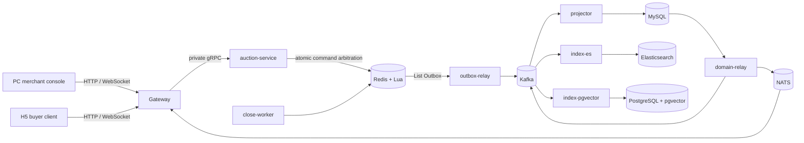

# ByteDanceliveauctioni

抖音电商直播竞拍全栈系统，包含 Go 后端、PC 商家工作台和移动 H5 买家端。项目覆盖拍品创建、排队开拍、实时出价、反狙击延时、封顶成交、异常取消、订单生成、模拟支付、WebSocket 状态恢复，以及 Elasticsearch/pgvector 混合检索。

## Repository structure

```text
ByteDanceliveauctioni/
├── live-auction-bid-backend/   # Go/Kratos backend and infrastructure
├── live-auction-bid-frontend/  # React/TypeScript PC merchant console
├── live-auction-user-h5/       # React/TypeScript mobile buyer client
├── SOURCE_REVISIONS.md         # Source snapshot provenance
├── SECURITY.md
└── LICENSE
```

## Architecture



The hot path is Redis-first: open, bid, close, and cancel commands are atomically arbitrated by Lua. The same Lua execution appends an immutable fact to a Redis List Outbox. `outbox-relay` delivers those facts to Kafka; `projector` applies them to MySQL with an inbox and database offset in the same transaction. MySQL Domain Outbox events then feed WebSocket fan-out, enrichment, and independent search consumers.

Redis Stream is not used by the target event pipeline. Kafka provides durable fan-out and replay after the Redis Outbox relay boundary; it does not replace Redis Lua as the low-latency command arbiter.

## Deployable backend units

| Unit | Responsibility |
| --- | --- |
| `gateway` | Public HTTP/WebSocket entry point; scales by connection count |
| `auction-service` | Redis Lua command arbitration through private gRPC |
| `outbox-relay` | Redis List Outbox to Kafka with lease/fencing recovery |
| `projector` | Kafka to MySQL transactional projection |
| `domain-relay` | MySQL Domain Outbox publication |
| `enrichment-consumer` | Optional order/address/shop enrichment |
| `index-es` | Elasticsearch keyword index projection |
| `index-pgvector` | Embedding and pgvector projection |
| `close-worker` | Deadline scan and Lua close arbitration |

## Key engineering properties

- Redis Lua combines state, deadline, minimum increment, idempotency, ranking, anti-snipe extension, cap settlement, and Outbox append in one atomic execution.
- Relay uses leased shards, fencing tokens, inflight takeover, retry, and an ACK Lua script so Kafka delivery is at least once without silently deleting unconfirmed facts.
- Projector uses Kafka partition ordering, an inbox, database offsets, version checks, retries, and repair tooling to provide idempotent, recoverable MySQL projection.
- WebSocket clients reconnect through a public Redis-backed snapshot before consuming new incremental events; private order/payment results stay on authenticated channels.
- Elasticsearch and pgvector use independent consumer groups and can be rebuilt from Kafka/MySQL without blocking the auction hot path.
- Prometheus/Grafana cover command latency and rejection, Relay backlog, Kafka lag, projection delay, lease state, database pools, and WebSocket behavior.
- Kubernetes manifests define separate workloads, health probes, disruption budgets, autoscaling, and optional search overlays.

## Requirements

- Docker Desktop or Docker Engine with Compose v2
- Go version declared by `live-auction-bid-backend/go.mod`
- Node.js 22 and npm
- At least 8 GB available memory for the base stack; search profiles require additional memory

## Local startup

The backend Compose stack requires a local environment file. The repository contains placeholders only; supply your own TOS credentials and never commit the resulting file.

```bash
cd live-auction-bid-backend/deploy
cp .env.example .env
# Fill the required AUCTION_TOS_* values in deploy/.env
docker compose up --build -d
```

Health checks:

```bash
curl http://127.0.0.1:18080/healthz
curl http://127.0.0.1:18080/readyz
curl http://127.0.0.1:18086/readyz
```

Start the PC console:

```bash
cd live-auction-bid-frontend
npm ci
npm run dev -- --host 0.0.0.0 --port 5173
```

Start the H5 client:

```bash
cd live-auction-user-h5
cp .env.example .env.local
npm ci
npm run dev -- --host 0.0.0.0 --port 5174
```

| App | URL |
| --- | --- |
| PC merchant console | `http://127.0.0.1:5173` |
| H5 buyer client | `http://127.0.0.1:5174` |
| Gateway API | `http://127.0.0.1:18080` |
| Grafana | `http://127.0.0.1:13000` |
| Prometheus | `http://127.0.0.1:19090` |

The local development merchant account is `main` / `main_dev_password`. It is a demo bootstrap credential and must be overridden outside local development.

## Optional search stack

Elasticsearch and pgvector are behind Compose profiles:

```bash
cd live-auction-bid-backend/deploy
docker compose --profile search up --build -d
```

DashScope embedding is optional for the base auction loop. When enabled, provide `AUCTION_EMBEDDING_API_KEY` only through the local environment or a production secret manager.

## Verification

```bash
cd live-auction-bid-backend
go test ./...
go build ./...

cd ../live-auction-bid-frontend
npm ci
npm test
npm run build

cd ../live-auction-user-h5
npm ci
npm run lint
npm run typecheck
npm test
npm run build
```

Root GitHub Actions run secret scanning, backend tests and integration checks, both frontend suites, image/infrastructure smoke tests, and archive evidence as workflow artifacts.

## Reliability boundary

The current design accepts a documented residual risk if the entire Redis replication set and its persisted Outbox are lost before Relay publishes to Kafka. See `live-auction-bid-backend/docs/ADR-2026-07-27-r3-redis-dual-loss-risk-acceptance.md`. A Kafka command-first design would change this boundary but is not implemented in this release.

## Security and public-delivery policy

- Real `.env` files, private keys, tokens, production endpoints, and local test artifacts are excluded.
- The public mirror imports tracked source snapshots, not private component Git histories.
- H5 captured/scraped fixture datasets and internal agent work notes remain outside the public boundary.
- See [SECURITY.md](SECURITY.md) before reporting or handling a suspected credential leak.

Project contributors: [Ye-yellow](https://github.com/Ye-yellow), [XB-Dong](https://github.com/XB-Dong).
