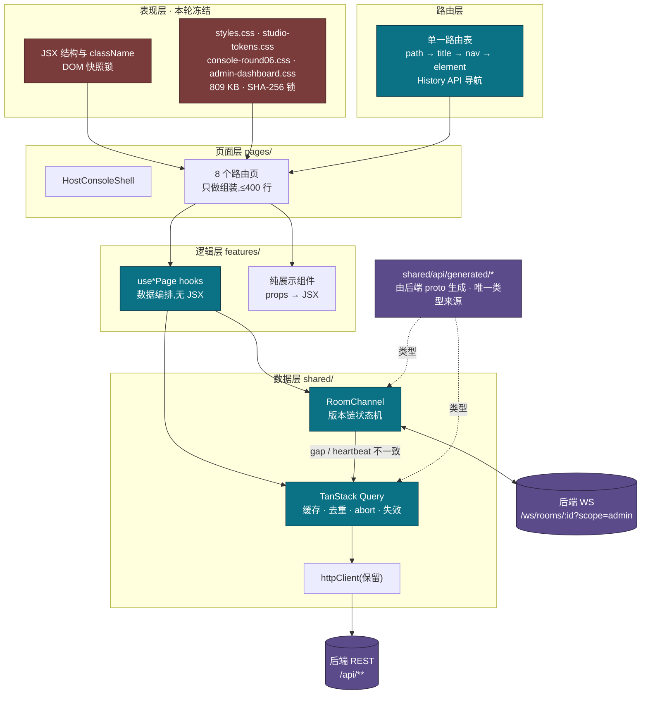
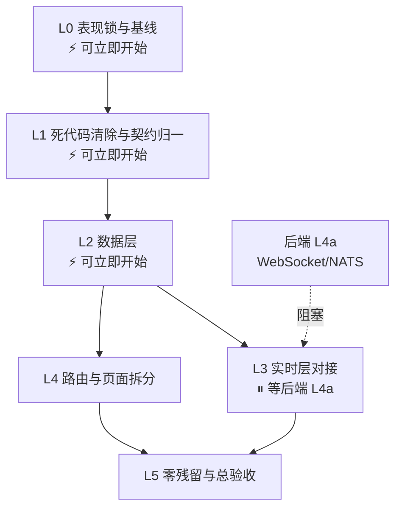

# live-auction-bid-frontend(商家后台)重构蓝图

> **日期**:2026-07-26 · **代码基线**:`c50fb4e`(当前工作区快照)
> **范围**:仅本仓库(主播团队工作台 PC Web)。H5 由另一路并行推进,本文只在 §6 约定两端必须共享的实时协议契约。
> **硬约束**:**视觉与交互表现冻结。本轮不改一个像素、不改一个 `className`、不改一句可见文案。**
> **技术选型**:TanStack Query · React Router · Vitest + Testing Library · Playwright · ESLint
>
> 全文代码引用带 `文件:行号`,体积与数量为实测。

> **实施结果（2026-07-26）**：后台 L0–L5 已按本蓝图完成并通过总验收。为满足 JS 体积预算，L4 最终采用项目内轻量 History API router，而未保留 React Router 依赖；URL、前进/后退和客户端导航语义不变。后端 L4a 已提供 camelCase `RealtimeEnvelopeV1` / `adminSnapshot`，L3 已完成联调式契约切换。`HomePage.tsx` 与买家 H5 明确由其他任务维护，本轮后台未修改。当前架构与实测数字以 [`FRONTEND_ARCHITECTURE.md`](./FRONTEND_ARCHITECTURE.md) 和 [`ADMIN_L0_PERFORMANCE_BASELINE.md`](./ADMIN_L0_PERFORMANCE_BASELINE.md) 为准；下文保留为决策蓝图与原始基线记录。

---

## 目录

- [0. 定位与约束](#0-定位与约束)
- [1. 现状盘点](#1-现状盘点)
- [2. 目标与验收标准](#2-目标与验收标准)
- [3. 原则](#3-原则)
- [4. 目标架构](#4-目标架构)
- [5. 核心技术决策](#5-核心技术决策)
- [6. 与新后端的对接契约](#6-与新后端的对接契约)
- [7. 工程门禁](#7-工程门禁)
- [8. 建造顺序](#8-建造顺序)
- [9. 零残留清单](#9-零残留清单)
- [10. 风险登记册](#10-风险登记册)
- [11. 反模式清单](#11-反模式清单)

---

# 0. 定位与约束

## 0.1 这一轮不是"救火"

先把话说清楚:**现有代码的工程卫生是好的。**

| 实测项 | 结果 |
|---|---|
| `any` / `@ts-ignore` / `@ts-expect-error` | **0 处** |
| `httpClient` 之外的裸 `fetch()` | **0 处** |
| `tsconfig` `strict` | ✅ 已开 |
| 请求鉴权、刷新、错误分类 | 收敛在 `shared/api/httpClient.ts` 一处,190 行,做得对 |

所以本轮**不是清理烂代码,是补三个结构性缺口**。这三个缺口有一个共同特征:**它们在当前 1 个直播间、几十个拍品的规模下都不疼,但后端 §2.2 的目标是全站 200 次/秒出价 —— 到那时三个缺口会同时线性放大。**

| 缺口 | 现状 | 放大后 |
|---|---|---|
| **没有数据层** | 每页各写 `useEffect` + `then/catch/finally` + `alive` 标志,全仓 **0 个 `AbortController`**、**0 处缓存** | 快速切页 → 旧请求仍在解析并 `setState`;并发响应乱序落地 |
| **没有路由** | `location.pathname` 字符串匹配,**三张匹配表手工同步**;导航靠 `location.href` 整页刷新 | 每次点导航整个 SPA 重新下载 + 重跑 `listAdminRooms()` |
| **实时层模型错了** | WS 当"缓存失效信号",收到事件就 HTTP 全量重拉,**无防抖** | 200 bids/s × 每个开着的后台标签页 = 对 API 的放大攻击 |

## 0.2 ⭐ 视觉冻结是硬约束,必须先变成门禁

> **"不动大表现"如果只是一句承诺,它一定会在第 3 个 PR 被破坏。本轮的第一件事是把它变成 CI 门禁。**

**"大表现"在本蓝图中的精确定义 = 三样东西**:

| 冻结对象 | 实测体积 | 冻结方式 |
|---|---:|---|
| `src/app/styles.css` | 384,742 B | SHA-256 锁 |
| `src/app/studio-tokens.css` | 318,948 B | SHA-256 锁 |
| `src/pages/host-console/styles/console-round06.css` | 73,508 B | SHA-256 锁 |
| `src/features/auction-manage/admin-dashboard.css` | 32,121 B | SHA-256 锁 |
| **DOM 结构**(标签层级 + `className` 序列) | 11 条路由 | 结构快照测试 |
| **可见文案** | 同上 | 同一份快照覆盖 |

**合计 809,319 B CSS —— 占构建产物的 62%(实测 `dist`:CSS 703 KB / JS 427 KB)。** 这是这个项目最贵的资产,也是本轮唯一不许动的东西。

**三道门禁(必须先于任何重构 PR 落地)**:

```bash
# ① 样式字节锁 —— scripts/check-visual-lock.mjs
#    对上表四个文件算 SHA-256,与 visual-lock.json 比对,不一致直接失败。
#    确需改样式时必须单独提 PR 改锁文件,让 diff 显式可见。

# ② DOM 结构快照 —— vitest + @testing-library
#    每条路由渲染后抓「标签层级 + className 序列 + 可见文本」存快照。
#    重构只允许数据流变化;快照变了就是表现变了。

# ③ 视觉回归 —— Playwright
#    11 条路由 × 2 个视口截图 diff,像素阈值 0。
```

> 有先例:`docs/FRONTEND_ARCHITECTURE.md` 记载 **2026-05-21 用户已确认 Home 页视觉冻结**。本轮把这条口头约定扩展到全站,并给它执行力。

## 0.3 明确不在本轮范围

| 项 | 原因 |
|---|---|
| 任何视觉/交互/文案改动 | §0.2 |
| H5(`live-auction-user-h5`) | 由另一路并行推进 |
| 设计系统重做 / CSS 瘦身 | 会动表现,单独立项 |
| 新业务功能 | 重构期不夹带功能 |
| `SettingsPage` / `AlertsPage` 的待接口占位 | 等后端接口,不造 mock |

---

# 1. 现状盘点

## 1.1 规模实测

```
src/  TS+TSX 10,763 行 · CSS 14,046 行(809 KB)
dist/ JS 427 KB · CSS 703 KB
```

| 文件 | 行数 | 备注 |
|---|---:|---|
| `shared/api/generated/auction.schema.ts` | 2,847 | **0 个引用方**(§1.4) |
| `pages/home/HomePage.tsx` | 1,165 | 34 个内联组件,11 个 `useEffect`,5 个 `setInterval` |
| `features/auction-manage/AdminDashboardPage.tsx` | 1,072 | 53 个内联组件,18 个 `useState`,8 个 `useEffect` |
| `features/auction-create/AuctionCreatePage.tsx` | 543 | |
| `shared/api/normalizers.ts` | 408 | 手写字段归一化(§1.3-D) |

## 1.2 明确保留的既有设计(不要重建)

> 对应后端蓝图**原则 6**:新建提案必须先做现状核查。以下八项已经存在且做得对。

| 能力 | 位置 | 为什么保留 |
|---|---|---|
| **HTTP 客户端** | `shared/api/httpClient.ts` | `X-Request-Id` 贯穿、单次 refresh 重试、result code 与 HTTP status 双通道错误分类、三种 typed error(`HttpError` / `ApiResultError` / `AuthExpiredError`) |
| **会话与令牌** | `shared/auth/authSession.ts` · `authStorage.ts` | 30s 主动续期 + 单飞 refresh |
| **路由级代码分割** | `app/App.tsx:5-7` | 三个入口都是 `lazy()`,已生效 |
| **WS 回源钩子** | `shared/realtime/roomSocket.ts:120-128` | 重连后 HTTP 回源快照 —— 正是后端 §8.2.2 要的机制,只是缺触发条件 |
| **状态枚举建模** | `entities/*/model/*.ts` | 拍品/订单状态集中定义,8 个页面复用 |
| **生成契约 + 漂移门禁的机制** | `package.json` `generate:api` · `.github/workflows/ci.yml` | 机制对,只是挂在死文件上(§1.4) |
| **FSD 分层的意图** | `app/entities/features/pages/shared/widgets` | 骨架保留,纠正越界(§5.5) |
| **手动 chunk 切分** | `vite.config.ts:8-14` | react / icons 分包已生效 |

## 1.3 三个结构性缺口(带证据)

### A. 数据层缺失

现状范式,在 8 个页面里各写一遍:

```tsx
// pages/host-console/HostConsolePage.tsx:96-118 —— 这个模板复制了 8 次
useEffect(() => {
  let alive = true;
  setLoading(true);
  listAdminRooms()
    .then((next) => { if (!alive) return; setRoom(next[0] || null); setError(''); })
    .catch((err) => { if (!alive) return; setError(...); })
    .finally(() => { if (alive) setLoading(false); });
  return () => { alive = false; };
}, []);
```

| 问题 | 后果 |
|---|---|
| **全仓 0 个 `AbortController`** | `alive` 只能阻止 `setState`,**阻止不了请求继续跑完、响应体继续解析**。快速切页会堆积在途请求 |
| 无请求去重 | 同一份 `listAdminRooms()` 被 Shell 与页面各拉一次 |
| 无缓存 | 每次导航(整页刷新)全量重拉 |
| `loading` / `error` / `data` 三份状态手工同步 | `AdminDashboardPage` 18 个 `useState`、`TeamAccountsPage` 18 个 |

### B. 路由缺失

**三张必须手工同步的匹配表**,任何新增路由要改三处:

```tsx
// pages/host-console/HostConsolePage.tsx
navGroups[].items[].match   // :20-38  侧边栏高亮
pathTitle(pathname)          // :41-53  页面标题
consoleRoutes[].match        // :66-77  渲染哪个页面
```

三张表用的是 `pathname.includes()`,已经出现了排他补丁:

```tsx
// :25 —— 为了让 /auctions 不吃掉 create/history/control,写了四重否定
match: (p) => p.includes('/auctions') && !p.includes('/auctions/create')
           && !p.includes('/auctions/history') && !p.includes('/control')
```

更根本的:

```tsx
// app/App.tsx:14 —— 渲染期读一次 location,永不响应
const { pathname } = location;
// features/auction-create/AuctionCreatePage.tsx:263 —— 导航 = 整页重载
window.setTimeout(() => { location.href = '/admin/auctions?queued=1'; }, 350);
```

**每次导航整个 SPA 重新下载、重新执行、重跑 `listAdminRooms()`。**

### C. 实时层模型错误 —— 会被后端目标线性放大

```tsx
// features/auction-manage/AuctionManagementPage.tsx:119
if (AUCTION_REFRESH_EVENTS.has(event.type)) void syncLots();   // 无防抖
// features/realtime-console/RealtimeConsolePages.tsx:51 · :182
if (HTTP_REFRESH_EVENTS.has(event.type)) void sync();          // 无防抖
```

`AUCTION_REFRESH_EVENTS` 含 13 个类型(`shared/realtime/events.ts:24-38`),其中包含 `BID_ACCEPTED`。

**推演**:单房间 100 次/秒出价(后端 §2.2 的单拍品目标)× N 个开着后台的标签页 = **每秒 100·N 次全量 `syncLots()`**。这不是"以后优化",这是把 WS 的收益反向变成 API 的负载。

另外两条:

| 问题 | 位置 | 说明 |
|---|---|---|
| `seq` 是客户端本地计数器 | `roomSocket.ts:79-82` | 每收一条 `+1`,**与服务端版本无关**,检测不了丢帧 |
| 重连抖动只有 400ms | `roomSocket.ts:29-32` | `800·2^(n-1)` 上限 30s,`+ random()*400`。**大规模重连时 ±200ms 约等于同时** —— 后端 R17 要的是 full jitter |

### D. 契约两份实现

> 对应后端蓝图**原则 3**:契约先行,且契约是代码。**手写两遍结构体必然出字段错位。**

```
后端 proto ──buf──> openapi/auction.openapi.json
                      └─openapi-typescript─> shared/api/generated/auction.schema.ts  (2,847 行, 0 引用)

实际在用的是: shared/api/normalizers.ts  (408 行, 手写)
```

`normalizers.ts:125` 的核心工具函数暴露了历史包袱:

```ts
function field(raw: JsonRecord, camel: string, snake = camel) { ... }   // camel/snake 双查
```

**这层 camel/snake 兼容现在已经没有必要**:后端 `realtime/hub.go:33-35` 与 `redis_bus.go:17-19` 都是 `UseProtoNames: false`,即统一 camelCase;业务路由也已在 `bc12b06 feat(api)!: migrate business routes to proto contracts` 统一到 proto 契约。

**而 CI 正在为一个没人用的文件把关**(`.github/workflows/ci.yml` 的 "Check generated API contract" 步骤)—— 门禁是对的,标的错了。

## 1.4 死代码清单(实测)

| 对象 | 证据 |
|---|---|
| `src/components/` | 空目录 |
| `src/features/realtime/` | 空目录 |
| `src/pages/live-room/` | 空目录 |
| `src/features/auction/ui/` · `auction/model/` | 空目录 |
| `src/features/ranking/ui/` · `playbook/ui/` | 空目录 |
| `src/lib/api.ts` | 4 行纯 re-export,**0 引用方** |
| `src/shared/types/auction.ts` | 1 行,只被上面这个死文件引用 |
| `src/widgets/order-management/OrderManagementPage.tsx` | 87 B re-export,**0 引用方** |
| `src/widgets/team-accounts/TeamAccountsPage.tsx` | 同上 |
| `src/shared/api/generated/auction.schema.ts` | 2,847 行,**0 引用方**(处置见 §5.4:不是删,是启用) |

**整个 `widgets/`、`lib/`、`components/`、`shared/types/` 四个层级已经是死的。**

---

# 2. 目标与验收标准

## 2.1 表现零变化(P0,无 SLO)

| 指标 | 目标 |
|---|---|
| CSS 四文件 SHA-256 | **逐字节不变** |
| 11 条路由 DOM 结构快照 | **零 diff** |
| Playwright 视觉回归 | **像素阈值 0** |
| 可见文案 | **零 diff** |

> **任何一条不满足都是 P0,PR 不合并。** 这是本轮唯一没有商量余地的验收项。

## 2.2 结构指标

| 指标 | 现状 | 目标 |
|---|---:|---:|
| 手写 `useEffect` 数据拉取 | 8 处模板复制 | **0** |
| `AbortController` 覆盖 | 0% | **100%(由 query 层统一提供)** |
| 路由匹配表 | 3 张手工同步 | **1 张** |
| WS 触发的 HTTP 全量重拉 | 3 处无防抖 | **0** |
| 单文件最大行数 | 1,165 | **≤ 400** |
| 空目录 / 零引用文件 | 10 处 | **0** |
| 生成契约引用方 | 0 | **≥ 1(成为唯一类型来源)** |
| 单元测试 | **0 个** | 数据层与实时层核心路径 ≥ 80% |
| ESLint | **无配置** | 全绿,零 `eslint-disable` |

## 2.3 性能指标(先量,再改,改完再量)

> 对应后端蓝图**原则 5**。下列基线在 L0 用固定脚本压出并归档,**没有数字的性能 PR 不合并**。

| 场景 | 基线(待 L0 实测) | 目标 |
|---|---|---|
| 导航到另一个后台页面 | 新增 1 次文档导航,重复 1 次 `listAdminRooms()` | **无重载,无重复请求** |
| 单房间 100 events/s 时后台发出的 API QPS | **0/s**(已包含 `0acd4c8` 的运营快照归并) | **≤ 2/s(合并窗口)** |
| `AdminDashboardPage` 每秒重渲染范围 | 根提交 1.25/s,覆盖 1,073 行页面 | **只重渲染倒计时叶子节点** |
| 快速连续切页后的请求中止覆盖 | 33 个调用点中 **0%** 可传 `AbortSignal` | **100%(全部 abort)** |
| JS 产物总量 | 431,498 B(129,068 B gzip) | **不劣化 + 20 KB 以内**(新依赖预算) |

`AdminDashboardPage.tsx:198-201` 是最典型的一处:

完整环境、命令、逐项解释与机器可读输出见 [`ADMIN_L0_PERFORMANCE_BASELINE.md`](./ADMIN_L0_PERFORMANCE_BASELINE.md)。

```tsx
useEffect(() => {
  const timer = window.setInterval(() => setNowMs(Date.now()), 1000);   // 页面级 state
  return () => window.clearInterval(timer);
}, []);
const analytics = useMemo(() => buildDashboardAnalytics({ lots, orders, snapshot, range, nowMs }), [..., nowMs]);
```

**每秒一次,整页 53 个组件重渲染,并对全量 lots+orders 重算一次 analytics。**

---

# 3. 原则

### 原则 1:表现冻结优先于一切
任何重构一旦与"保持表现不变"冲突,**放弃这次重构,不是放松冻结**。执行手段是 §0.2 的三道门禁,不是自觉。

### 原则 2:一份数据只有一个来源
服务端数据的唯一来源是 query 层;实时状态的唯一来源是版本链 store。**同一份数据不允许既在 `useState` 里、又在 query cache 里。**

### 原则 3:契约是生成的,不是手写的
与后端蓝图原则 3 同源。生成物必须**被引用**,否则漂移门禁是在保护空气。

### 原则 4:权限边界由服务端维持,前端不做分类
后台能看到真实买家身份,**是因为服务端按 ticket scope 授权下发**,不是因为"这是 admin 页面所以我解开"。对应后端原则 4:安全性来自内容,不来自分类。

### 原则 5:先量,再改;改完再量
性能相关 PR 附改前/改后同机数据。§2.3 的基线在 L0 建立。

### 原则 6:不重建已经存在的能力
§1.2 列出的八项都已存在。新增提案必须带一行"现状核查:`<路径>` / 不存在"。

### 原则 7:库按语义选型,不按流行度
每引入一个依赖必须写明:**它替代了什么、语义为什么匹配、以及它不该被用在哪。** §5 是这条原则的产物。

### 原则 8:不留过渡态
不保留"旧写法开关"。回退靠 Git,不靠运行时双栈。对应后端原则 1。

---

# 4. 目标架构



## 4.1 层级职责边界

| 层 | 承担 | **明确不承担** |
|---|---|---|
| **表现层** | className / DOM 结构 / 文案 / 样式 | ❌ 数据获取 ❌ 业务判定 |
| **路由层** | path ↔ title ↔ nav ↔ element 的**唯一**映射 | ❌ 数据预取 ❌ 权限判定(交给 `ProtectedRoute`) |
| **页面层** | 组装 hook 与展示组件 | ❌ 直接调 API ❌ 直接持有 WebSocket |
| **逻辑层** | 数据编排、副作用、派生计算 | ❌ 任何 JSX |
| **数据层** | 缓存 / 去重 / abort / 失效 / 版本链 | ❌ 业务语义 ❌ 渲染 |

---

# 5. 核心技术决策

## 5.1 数据层:TanStack Query

**替代对象**:8 处 `useEffect + then/catch/finally + alive` 模板(§1.3-A)。

**语义为什么匹配**:后台页面里的 lots / orders / rooms / users **不是组件状态,是服务端状态的本地副本**。副本天然需要缓存、失效、去重、取消 —— 这正是 query 库的语义,而 `useState` 的语义里一条都没有。

| 现状缺陷 | Query 的答案 |
|---|---|
| 0 个 `AbortController` | `queryFn({ signal })` 直接透传,切页自动 abort |
| 同一数据被 Shell 与页面各拉一次 | 相同 key 自动去重 |
| 导航后全量重拉 | 缓存 + `staleTime` |
| `loading`/`error`/`data` 三份手工状态 | 单一返回值 |
| WS 事件触发全量重拉、无防抖 | `invalidateQueries` + 合并窗口(§5.3) |

**它不该被用在哪**(原则 7 要求写明):

> ❌ **不要把实时版本链状态塞进 query cache。** 拍品的 `lot_version` 链是一个**状态机**,不是缓存 —— 它要求单调、连续、可检测 gap。query cache 的语义是"可以任意时刻被丢弃和重取",两者相冲。实时状态归 §5.3 的 `RoomChannel`,query 只负责**被它触发的回源**。

> ❌ **不要用它做表单状态。** `AuctionCreatePage` 的草稿是客户端状态。

**接入方式(不动表现的关键)**:`useQuery` 只在 `use*Page` hook 内出现,页面组件的 props 形状不变,JSX 一行不改。

## 5.2 路由:单一路由表 + History API

**替代对象**:三张手工同步的匹配表(§1.3-B)。

**决策:React Router。** 理由是本项目**路由极其简单** —— 10 条路径、**零路径参数**(`roomId` 来自 `listAdminRooms()`,不在 URL 里)。这种形态不需要 TanStack Router 的类型化参数推导,React Router 的心智负担和体积都更低。

收敛成一张表:

```ts
// pages/host-console/routes.tsx —— 唯一来源
export const consoleRoutes = [
  { path: '/admin/auctions/create', title: '添加拍品', nav: 'prepare', element: <AuctionCreatePage /> },
  ...
] satisfies ConsoleRoute[];
// 侧边栏高亮、页面标题、渲染目标全部从这一张表派生
```

**URL 一个字都不改**(`/admin`、`/admin/auctions`、`/admin/auctions/create`、`/admin/auctions/history`、`/admin/auctions/current/control`、`/admin/orders`、`/admin/bids`、`/admin/merchants`、`/admin/settings`、`/admin/alerts`、`/host*` 别名全部保留),导航从整页重载改为 History API。

> ⚠️ **这是本轮唯一的行为变化**(更快,但不再重置全局状态)。整页刷新目前掩盖了潜在的状态泄漏,所以**必须在 L2 数据层完成之后再做**,否则会把泄漏暴露成 bug。分层顺序见 §8。

## 5.3 ⭐ 实时层:版本链状态机,不是事件广播

> **这是"对接新后端"的核心,也是本蓝图技术含量最高的一节。**

现有模型(`roomSocket.ts` + `events.ts`)是:**收到 18 种事件之一 → 触发 HTTP 全量重拉**。
新后端模型(`api/auction/service/v1/realtime.proto`)是:**服务端推送带版本号的完整快照,客户端维护版本链**。

这不是"改几个字段名",是**换模型**。

### 新模型

```
                    ┌─────────────── RoomChannel(新增)───────────────┐
公共快照 Snapshot ─→│                                                │
私有增量 Delta   ─→│  按 lot_version 归并,维护单调版本链            │──→ 视图状态
心跳 Heartbeat   ─→│  gap / 心跳不一致 → 触发 query 回源             │──→ invalidateQueries
运营快照 Admin   ─→└────────────────────────────────────────────────┘
```

| 规则 | 说明 |
|---|---|
| **单调性** | `lot_version` 只增不减;收到更低版本**直接丢弃**,不是覆盖 |
| **连续性** | `lot_version` 跳号 → 判定 gap → **触发一次回源**,而不是当作正常事件 |
| **心跳校验** | `RoomHeartbeatV1.authoritative_lot_version` 与本地不一致 → 回源 |
| **终态可达** | Core NATS 是 at-most-once(后端 §5.3),**终态消息会丢**。终态只能靠"版本连续性 + 心跳 + 回源"三件套发现,不能指望必达 |
| **tombstone** | `PersonalDeltaV1.tombstone` 表示"你不再在榜上",必须显式清除本地私有态,而不是保留旧值 |
| **合并窗口** | 高频版本推进在 ~75ms 窗口内合并后再渲染,对齐后端 `roomCoalesceDelay` |

### 必须删掉的三行

```tsx
// features/auction-manage/AuctionManagementPage.tsx:119
if (AUCTION_REFRESH_EVENTS.has(event.type)) void syncLots();      // ❌ 删除
// features/realtime-console/RealtimeConsolePages.tsx:51 · :182
if (HTTP_REFRESH_EVENTS.has(event.type)) void sync();              // ❌ 删除
```

替代:快照直接就是视图状态,**只有 gap / 心跳不一致 / 重连才回源**。这把 API 负载从"每条事件一次"降到"每次异常一次"。

### 重连:换成 full jitter

```ts
// 现状 roomSocket.ts:29-32 —— 抖动只有 400ms,大规模重连约等于同时
const base = Math.min(30_000, 800 * 2 ** Math.max(0, attempt - 1));
return base + Math.floor(Math.random() * 400);

// 目标 —— full jitter(对齐后端 R17)
return Math.random() * Math.min(30_000, 800 * 2 ** Math.max(0, attempt - 1));
```

### 保留

`recoverSnapshot`(`roomSocket.ts:120-128`)整体保留 —— 它已经是正确的回源机制,本轮只是给它补上**触发条件**(gap / 心跳不一致),而不是只在 `onopen` 时调一次。

## 5.4 契约:让生成物成为唯一类型来源

**现状**:2,847 行生成物 0 引用,408 行手写 normalizer 在实际工作,CI 在为生成物把关(§1.3-D)。

**决策**:

1. `shared/api/generated/*` 成为**唯一**类型来源,`shared/api/types.ts` 的手写业务类型改为从生成物派生。
2. `normalizers.ts` **不删,但收缩职责**:从"字段名翻译 + 类型转换 + 默认值"收缩为"**运行时校验 + 默认值**"。camel/snake 双查(`normalizers.ts:125`)删除 —— 后端已统一 camelCase(`hub.go:33-35`、`redis_bus.go:17-19` 均 `UseProtoNames: false`)。
3. WS 消息类型从后端 `realtime.proto` 生成,**不手写**。
4. CI 的漂移门禁保留,但此时它保护的是**被引用的**文件。

> 预期 `normalizers.ts` 从 408 行降到 150 行以内,且不再有"两端各写一遍字段名"的错位风险。

## 5.5 页面拆分:1,072 行怎么拆而不动 DOM

**唯一安全的拆分顺序**——顺序反了就一定会动到表现:

```
① 抽 hook:把 useState/useEffect/useMemo 搬进 use<Page>() ,JSX 一行不动
   → 跑 DOM 快照,必须零 diff
② 抽纯组件:把 JSX 块整段剪切进独立文件,props 传入,className 原样搬运
   → 跑 DOM 快照 + 视觉回归,必须零 diff
③ 优化重渲染:此时才动 memo / 状态下沉
   → 跑性能基线对比
```

**每一步单独提 PR,每一步都过三道门禁。** 严禁"顺手改一下这个 class 名"。

`AdminDashboardPage` 那个每秒重渲染整页的问题(§2.3),在第 ③ 步用一行解决:**把 `nowMs` 从页面级 state 下沉到真正需要它的倒计时叶子组件**。页面不再每秒重渲染,`buildDashboardAnalytics` 不再每秒重算,而 DOM 输出完全一致。

## 5.6 决策速查表

| 我要做的事 | 用什么 | 不用什么 |
|---|---|---|
| 拉一份服务端列表 | `useQuery` | ❌ `useEffect` + `alive` |
| 切页时停掉在途请求 | query 的 `signal` | ❌ `alive` 布尔(拦不住请求) |
| 出价后刷新列表 | `invalidateQueries` | ❌ 手动 `void syncLots()` |
| 收到实时事件 | 用快照直接更新视图 | ❌ 触发 HTTP 全量重拉 |
| 判断实时数据是否可信 | `lot_version` 连续性 + 心跳 | ❌ 客户端本地 `seq` 计数器 |
| 发现丢了终态 | 心跳 `authoritative_lot_version` 比对 → 回源 | ❌ 指望 Core NATS 必达 |
| 后台展示买家真名 | 服务端按 `scope=admin` 授权下发的运营快照 | ❌ 前端"因为是 admin 页面所以显示" |
| 新增一条后台路由 | 改 `routes.tsx` 一处 | ❌ 改三张匹配表 |
| 页面间跳转 | History API | ❌ `location.href` |
| 定义一个 API 返回类型 | 从生成物派生 | ❌ 手写 interface |
| 大规模重连退避 | full jitter | ❌ 固定 ±400ms 抖动 |

---

# 6. 与新后端的对接契约

## 6.1 后端进度对齐(核实于 2026-07-26)

| 后端层 | 状态 | 对本轮的影响 |
|---|---|---|
| L1 契约 | ✅ `api/auction/service/v1/realtime.proto` 已定义 | **WS 消息类型现在就能生成**,不必等实现 |
| L3 Runtime 主干 | 🔨 进行中(domain-relay 在写) | 不影响后台 |
| **L4a WebSocket/NATS** | ❌ **未开始**,`realtime.proto` 在后端非测试代码中 **0 引用** | **§5.3 的联调必须等它** |

> 也就是说:**契约可以现在就对齐,实现必须等后端 L4a。** §8 的建造顺序按这个事实排布。

## 6.2 四类消息(来自后端 `realtime.proto`)

| 消息 | 用途 | 后台关注点 |
|---|---|---|
| `RoomSnapshotPublicV1` | 公共脱敏快照:`lot_version` / `current_price_fen` / `ends_at_unix_ms` / `bid_count` / `top_ranking`(脱敏昵称) | 版本链主干 |
| `PersonalDeltaV1` | 私有增量:`your_rank` / `you_are_leading` / `your_order_id` / `tombstone` | 后台不用(后台不是买家) |
| `RoomHeartbeatV1` | `authoritative_lot_version` + `server_time_unix_ms` | **终态自愈的关键** |
| `AdminRankingItemV1` | 运营快照:**真实** `user_id` / `nickname` / `avatar_url` | 后台的出价明细、中控台 |

## 6.3 ⭐ 后台的隐私边界

后台确实需要真实买家身份(`AdminRankingItemV1`)。**但这条边界必须由服务端维持:**

```
✅ 正确:ws-ticket 带 scope=admin → 服务端校验权限 → 单独下发含真名的运营消息
❌ 错误:公共快照里带真名,前端根据"我是 admin 页面"决定显不显示
```

对应后端**原则 4**:安全性来自内容,不来自分类。后端 §8.6 把"买家身份零泄漏"列为 P0 且由测试强制 —— 前端**不得**成为这条约束的漏洞。

现有 `roomSocket.ts:36-38` 已经在 URL 上带了 `scope=admin` 与 ticket,机制是对的,本轮保留并强化:**后台代码里不允许出现"从公共消息里读真名"的路径**,由 §7 的静态检查强制。

## 6.4 与 H5 的协同点(仅约定,不由本轮实施)

后端 §14.5 L4a 的出口条件是"**两个前端协议同时完成,不存在只升级一端的窗口**"。H5 由另一路推进,本轮只需保证:

- WS 消息类型**从同一份后端 proto 生成**,不各写各的;
- 版本链归并规则(单调 / 连续 / tombstone / 心跳回源)两端语义一致;
- 切换时机与后端 L4a 对齐,**不单独上线**。

---

# 7. 工程门禁

现有 CI(`c50fb4e`)只有两个 job:`build` 与 `contract drift`。本轮补齐。

## 7.1 表现锁(P0,最先落地)

```bash
npm run check:visual-lock        # 四个 CSS 文件 SHA-256 比对
npm run test:dom                 # 11 条路由 DOM 结构快照
npm run test:visual              # 11 条路由 × 2 视口,像素阈值 0
```

## 7.2 静态门禁

- **ESLint**(直接复用 H5 仓库的 `eslint.config.js` 基线):`react-hooks` 全开,零 `eslint-disable`。
- **禁止 `useEffect` 内直接调 API**:自定义 lint 规则或 `no-restricted-syntax`,防止旧范式回流。
- **禁止 `location.href` 导航**:`no-restricted-properties`,L3 之后生效。
- **禁止从公共 WS 消息读身份字段**:`no-restricted-syntax` 匹配 `RoomSnapshotPublicV1` 上的 `nickname` / `userId` 访问(§6.3)。
- **死代码检查**:`knip` 或 `ts-prune`,零引用文件与空目录直接失败(§1.4 清单归零后常驻)。

## 7.3 测试门禁

| 范围 | 要求 |
|---|---|
| 数据层 | query key 唯一性、失效传播、abort 生效 |
| **实时层** | 乱序到达、相同版本、跳版本→回源、tombstone、心跳不一致→回源、重连 full jitter 分布 |
| 契约 | 生成物与后端 proto 无漂移;normalizer 对未知字段的容忍 |
| 路由 | 一张表派生的 title/nav/element 三者自洽 |
| 表现 | §7.1 |

> 实时层的测试**必须检查最终状态**,而不只是"回调被调用了" —— 对应后端 §13.6。

## 7.4 体积门禁

JS 产物预算:**427 KB + 20 KB**。新依赖超预算必须在 PR 里说明换来了什么。

## 7.5 最终验收命令

```bash
npm run lint
npm run test
npx playwright test
npm run build
npm run check:visual-lock
npx knip
npm run generate:api && git diff --exit-code -- src/shared/api/generated
```

---

# 8. 建造顺序

**关键调度事实**:L0–L2 **不依赖后端**,现在就能做,与后端 L3 并行。L3 依赖后端 L4a(尚未开始)。



## 8.1 L0:表现锁与基线

**工作**:四个 CSS 的 SHA-256 锁 + 脚本;11 条路由的 DOM 结构快照;Playwright 视觉回归基线;ESLint 接入(仅报告,不阻断);§2.3 五项性能基线压测并归档。

**出口**:三道表现门禁在 CI 里跑通并**故意改一个 class 名验证它会失败**;性能基线可重复。

> **这一层不做任何重构。** 它的唯一产出是"改坏了会被发现"的能力。

## 8.2 L1:死代码清除与契约归一

**工作**:删除 §1.4 的 10 处死对象;`generated/*` 接入为唯一类型来源;`normalizers.ts` 收缩为运行时校验;WS 消息类型从 `realtime.proto` 生成(**只生成类型,不改运行时**);ESLint 转为阻断。

**出口**:`knip` 零发现;生成物有引用方;表现三门禁零 diff。

## 8.3 L2:数据层

**工作**:接入 TanStack Query;8 处 `useEffect` 模板逐页迁移(**一页一个 PR**);query key 规范;错误边界与 `AuthExpiredError` 联动;`AdminDashboardPage` 的 `nowMs` 状态下沉。

**出口**:手写数据拉取 `useEffect` 归零;在途请求可 abort;导航不再重复请求;**表现三门禁零 diff**;性能基线中"快速切页在途请求数"降为 0。

## 8.4 L3:实时层对接(⏸ 等后端 L4a)

**固定顺序**:

1. `RoomChannel` 版本链状态机 + 单元测试(**可先于后端实现,用 fixture 驱动**)
2. 四类消息分流与归并
3. gap / 心跳不一致 → 触发 query 回源
4. full jitter 重连
5. 删除三处 `X_REFRESH_EVENTS → HTTP 全量重拉`
6. 与后端 L4a 联调,与 H5 同步切换

**出口**:乱序/跳版本/tombstone/心跳不一致/断线丢终态全部有测试;单房间 100 bids/s 时后台 API QPS ≤ 2/s;**表现三门禁零 diff**;不存在只升级一端的窗口(§6.4)。

## 8.5 L4:路由与页面拆分

**工作**:三张匹配表收敛为一张;History API 导航(URL 不变);按 §5.5 的三步法拆 `HomePage`(1,165 行)与 `AdminDashboardPage`(1,072 行)。

**出口**:单文件 ≤ 400 行;新增路由只改一处;导航无整页重载;**表现三门禁零 diff**。

> ⚠️ 必须排在 L2 之后:整页刷新目前掩盖着状态泄漏。

## 8.6 L5:零残留与总验收

**工作**:执行 §9;更新 `docs/FRONTEND_ARCHITECTURE.md`;跑 §7.5 全部命令。

**出口**:§2.1 / §2.2 / §2.3 全部达标;`docs/` 描述的架构与代码一致。

---

# 9. 零残留清单

## 9.1 删除

| 对象 | 处置 |
|---|---|
| `src/components/` · `src/features/realtime/` · `src/pages/live-room/` | 空目录,删除 |
| `src/features/auction/ui/` · `auction/model/` · `ranking/ui/` · `playbook/ui/` | 空目录,删除 |
| `src/lib/api.ts` · `src/shared/types/auction.ts` | 零引用,删除 |
| `src/widgets/` 整层 | 两个零引用 re-export shim,删除 |
| `normalizers.ts` 的 camel/snake 双查(`:125`) | 后端已统一 camelCase,删除 |
| `roomSocket.ts` 的本地 `seq` 计数器(`:79-82`) | 由服务端 `lot_version` 取代 |
| `events.ts` 的 `AUCTION_REFRESH_EVENTS` / `HTTP_REFRESH_EVENTS` / `ORDER_REFRESH_EVENTS` | 随"事件触发全量重拉"模型一起删除 |
| 8 处 `useEffect + alive` 数据拉取模板 | 由 query 取代 |
| `HostConsolePage.tsx` 的 `pathTitle` 与 `navGroups[].match` | 并入唯一路由表 |

## 9.2 不允许保留的过渡态

- ❌ "旧数据获取方式"的开关
- ❌ "旧 WS 协议"的兼容分支
- ❌ 任何 `// TODO: 迁移完再删` 的双路径

> 回退靠 Git,不靠运行时双栈。对应后端原则 1 与 R26。

## 9.3 文档同步

`docs/FRONTEND_ARCHITECTURE.md` 的目录结构段落已经与实际不符(它没有记录 `entities/`、`widgets/`、`lib/`)。L5 一并重写,并明确标注视觉冻结策略。

---

# 10. 风险登记册

| ID | 风险 | 影响 | 缓解 | 早期信号 |
|---|---|---|---|---|
| **F1** | **重构过程中动到表现** | **违反本轮唯一硬约束,P0** | §0.2 三道门禁先行;§5.5 三步拆分法;每步单独 PR | 视觉门禁失败 |
| F2 | 后端 L4a 迟迟不落地,L3 空转 | 排期风险 | L0–L2 与后端并行;`RoomChannel` 用 fixture 先写完 | 后端 L4a 未启动 |
| F3 | 只升级后台、H5 未同步 | 违反后端 §14.5 出口条件 | §6.4 协同约定;切换与 H5 同批 | 两仓协议版本不一致 |
| F4 | History API 导航暴露既有状态泄漏 | 出现"看起来是新 bug"的旧问题 | L4 排在 L2 之后;逐路由灰度 | 切页后残留旧数据 |
| F5 | query 缓存与实时状态出现两份真相 | 价格/状态显示不一致 | 原则 2;实时状态不进 query cache(§5.1) | 同一字段两处不同值 |
| F6 | 公共快照里读到身份字段 | 隐私事故,P0 | §6.3 边界 + §7.2 静态检查 | lint 命中 |
| F7 | 新依赖撑爆体积 | 首屏劣化 | §7.4 预算 20 KB | 体积门禁失败 |
| F8 | 大页面拆分时 `useMemo` 依赖漂移 | 隐性性能回退或 stale 渲染 | `react-hooks` lint 全开;拆分前后跑性能基线 | 基线对比劣化 |
| F9 | 生成物再次变成无人引用的死文件 | 契约漂移门禁失效 | §7.5 的 `knip` 常驻 | 死代码检查命中 |
| F10 | 后端 WS 契约在 L4a 实施中变更 | 前端返工 | 只依赖 proto 生成物,不手写;变更走 buf breaking | 生成物 diff |

**风险关闭规则**:F1 与 F6 是 P0,**不得以"概率低"关闭**,必须有自动化证据。

---

# 11. 反模式清单

| ❌ 禁止 | 原因 | ✅ 正确做法 |
|---|---|---|
| 重构时"顺手"改 class 名 / 调间距 | 违反本轮唯一硬约束 | 表现改动单独立项,单独 PR 改锁文件 |
| 用 `alive` 布尔当请求取消 | 拦得住 `setState`,拦不住请求继续跑完 | `AbortController`(由 query 层提供) |
| `useEffect` 里直接 `fetch` / 调 API | 手工同步三份状态,必然漏 case | `useQuery` |
| 收到 WS 事件就 HTTP 全量重拉 | 把 WS 的收益反向变成 API 负载 | 快照即视图状态;只在 gap/心跳异常时回源 |
| 用客户端 `seq` 计数器判断有没有丢消息 | 本地计数与服务端版本无关 | 服务端 `lot_version` 连续性 |
| 指望 Core NATS 必达终态 | at-most-once,终态会丢 | 版本连续性 + 心跳 + 回源 |
| 前端按"这是 admin 页面"决定显不显示真名 | 分类会漂移,漂移时不报错 | 服务端按 ticket scope 授权下发 |
| 固定小抖动的重连退避 | 大规模重连约等于同时 | full jitter |
| 新增路由改三张匹配表 | 手工同步必然漏一张 | 唯一路由表派生 |
| `location.href` 做站内导航 | 整个 SPA 重载 | History API |
| 手写 API 返回类型 | 两端各写一遍必然字段错位 | 从后端 proto 生成 |
| 让生成的契约文件没有引用方 | 漂移门禁在保护空气 | 生成物作为唯一类型来源 |
| 把实时版本链塞进 query cache | 状态机 ≠ 缓存,缓存可被任意丢弃 | 独立 `RoomChannel` |
| 页面级 1 秒 tick 驱动全页重渲染 | 整页 + 全量派生计算每秒重跑 | 状态下沉到叶子节点 |
| 保留"旧写法"开关以防万一 | 最终留下两套语义和两套测试 | §9 零残留,回退靠 Git |

## 11.1 实施判定

本蓝图"完成"指:

1. §2.1 表现零变化的三道门禁在 CI 常驻且全绿。
2. §2.2 结构指标全部达标。
3. §2.3 性能指标有改前/改后同机数据。
4. §9 零残留清单归零,`knip` 零发现。
5. §10 中 F1、F6 两个 P0 有自动化证据。
6. `docs/FRONTEND_ARCHITECTURE.md` 与代码描述同一套结构。

---

*代码位置引用基于 2026-07-26 工作区快照(`c50fb4e`)。体积与数量为实测。*

*建造顺序:L0 → L1 → L2 →(L3 ⏸ 等后端 L4a ∥ L4)→ L5。L0 的表现锁不可跳过。*
